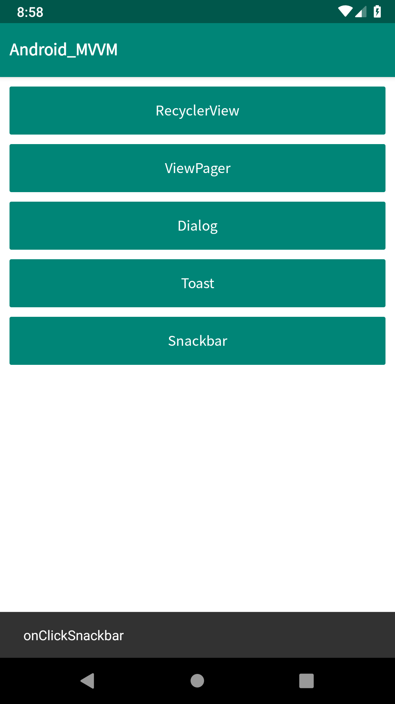

# Android-MVVM

코틀린을 사용한 Android MVVM 패턴 샘플 코드.

## 목차
1. [안드로이드 버전 정보](#안드로이드-버전-정보)
2. [사용한 주요 라이브러리](#사용한-주요-라이브러리)
3. 스크린샷
    1. [MainActivity](#mainactivity)
    2. [RecyclerView](#recyclerview)
    3. [ViewPager](#viewpager)
    4. [Fragment](#fragment)
    5. [PopupDialog](#popupdialog)
    6. [BottomSheetDialog](#bottomsheetdialog)
    7. [Toast](#toast)
    8. [Snackbar](#snackbar)

## [사용한 주요 라이브러리](#목차)
| name                                                                                              |
|---------------------------------------------------------------------------------------------------|
| [Android Support Libraries](https://developer.android.com/topic/libraries/support-library/?hl=ko) |
| [Android Architecture Component](https://developer.android.com/topic/libraries/architecture)      |
| [RxAndroid](http://reactivex.io/)                                                                 |
| [Retrofit2](https://square.github.io/retrofit)                                                    |
| [Moshi](https://github.com/square/moshi)                                                          |
| [Glide](https://github.com/bumptech/glide)                                                        |
| [Koin](https://github.com/InsertKoinIO/koin)                                                      |
| [Mockk](https://github.com/mockk/mockk)                                                           |

## [MainActivity](#목차)

## [RecyclerView](#목차)

## [ViewPager](#목차)

## [Fragment](#목차)

## [PopupDialog](#목차)

## [BottomSheetDialog](#목차)

## [Toast](#목차)

## [Snackbar](#목차)
